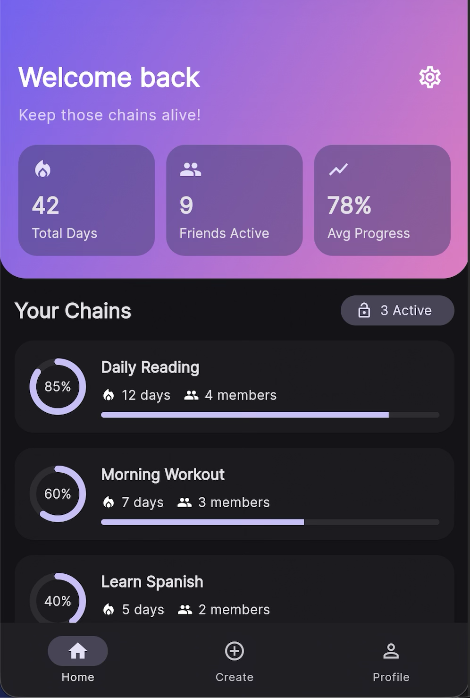
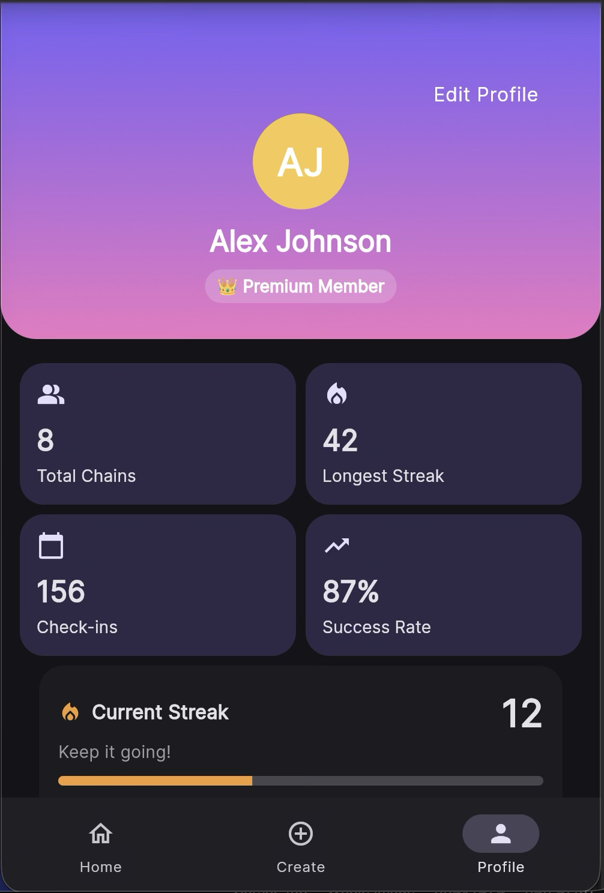
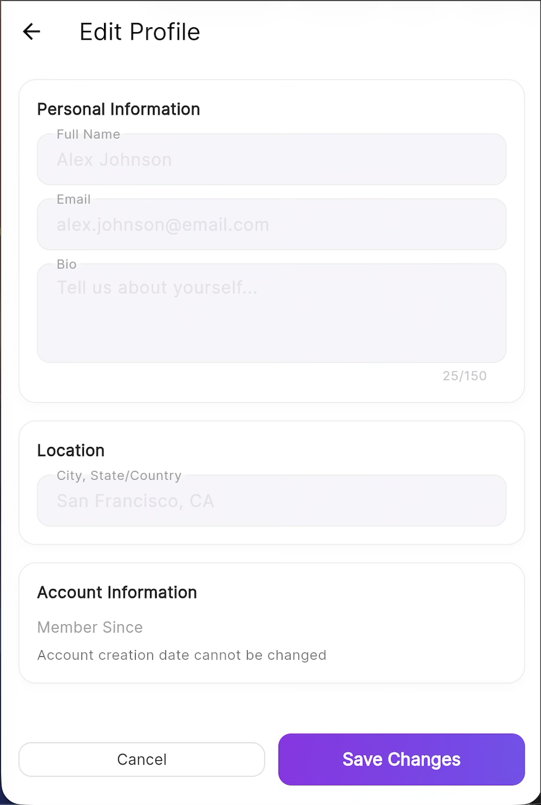
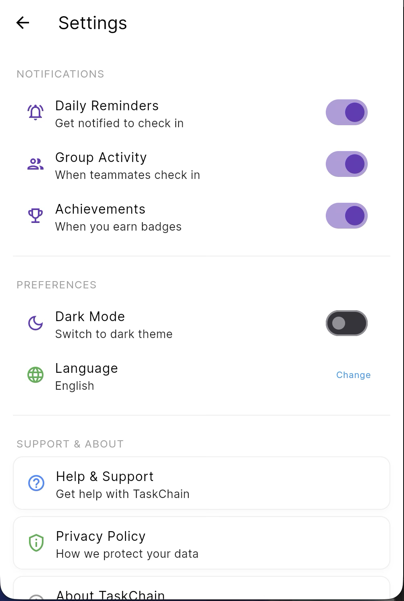
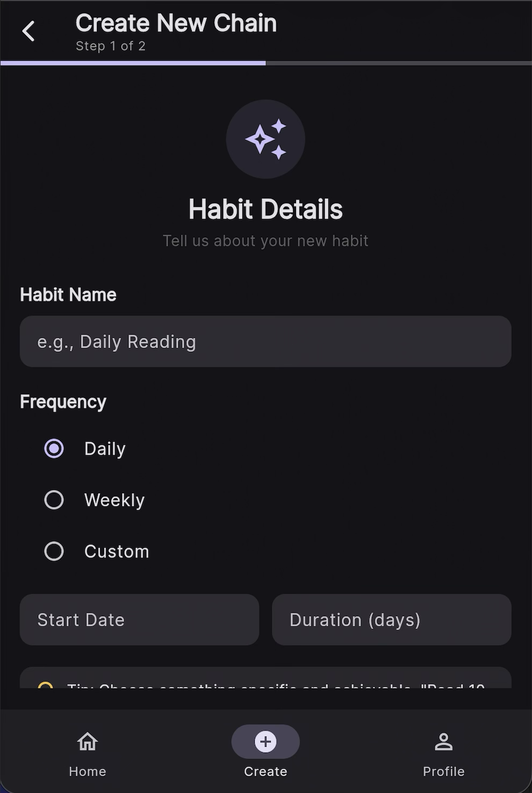

# TaskChain

A Flutter-based mobile application for building and maintaining task chains with friends. Track your progress, stay accountable, and achieve your goals together!

## Features

- 🏠 **Home Dashboard** - View active chains, progress stats, and recent achievements
- ➕ **Multi-Step Chain Creation** - Create new task chains with customizable settings
- 👤 **Profile Management** - View and edit your profile information
- ⚙️ **Settings** - Customize notifications, preferences, and account settings
- 🔐 **Authentication** - Secure sign-in functionality
- 📊 **Progress Tracking** - Visual progress indicators and statistics
- 🏆 **Achievements** - Earn badges and rewards for consistency

## Screenshots

### Login

*Sign in to your TaskChain account*

### Home Page

*Dashboard showing active chains, stats, and achievements*

### Profile Page

*User profile with statistics and chain information*

### Edit Profile

*Edit personal information, bio, and location*

### Settings Page

*Comprehensive settings for notifications, preferences, and account management*

### Create Chain - Step 1

*First step of chain creation flow*

### Create Chain - Step 2

*Second step of chain creation flow*

## Getting Started

### Prerequisites

- Flutter SDK (3.0 or higher)
- Dart SDK (3.0 or higher)
- Chrome, Android Studio, or Xcode (depending on target platform)

### Installation

1. Clone the repository:
```bash
git clone https://github.com/nitrogen404/csen268.git
cd csen268/taskchain
```

2. Install dependencies:
```bash
flutter pub get
```

3. Run the app:
```bash
# For web
flutter run -d chrome

# For macOS
flutter run -d macos

# For mobile (with emulator/device connected)
flutter run
```

## Project Structure

```
taskchain/
├── lib/
│   ├── models/
│   │   └── profile.dart           # Profile data model
│   ├── pages/
│   │   ├── home_page.dart         # Home dashboard
│   │   ├── profile_page.dart      # User profile
│   │   ├── edit_profile_page.dart # Profile editing
│   │   ├── settings_page.dart     # App settings
│   │   ├── sign_in_page.dart      # Authentication
│   │   ├── create_chain_step1.dart # Chain creation (step 1)
│   │   └── create_chain_step2.dart # Chain creation (step 2)
│   ├── widgets/
│   │   ├── achievement_card.dart  # Achievement display
│   │   ├── chain_card.dart        # Chain card component
│   │   ├── progress_ring.dart     # Circular progress indicator
│   │   └── stat_tile.dart         # Statistics tile
│   ├── main.dart                  # App entry point
│   └── theme.dart                 # App theme configuration
├── android/                       # Android platform files
├── ios/                          # iOS platform files
├── web/                          # Web platform files
├── macos/                        # macOS platform files
├── linux/                        # Linux platform files
└── windows/                      # Windows platform files
```

## Platform Support

- ✅ Android
- ✅ iOS
- ✅ Web
- ✅ macOS
- ✅ Linux
- ✅ Windows

## Technologies Used

- **Flutter** - Cross-platform UI framework
- **Dart** - Programming language
- **Google Fonts** - Typography
- **Material Design 3** - Design system

## Contributing

1. Fork the repository
2. Create your feature branch (`git checkout -b feature/AmazingFeature`)
3. Commit your changes (`git commit -m 'Add some AmazingFeature'`)
4. Push to the branch (`git push origin feature/AmazingFeature`)
5. Open a Pull Request

## Resources

- [Flutter Documentation](https://docs.flutter.dev/)
- [Material Design 3](https://m3.material.io/)
- [Dart Language Tour](https://dart.dev/guides/language/language-tour)

## License

This project is part of the CSEN268 course at Santa Clara University.

## Team

Developed as part of CSEN268 Mobile Application Development course.
